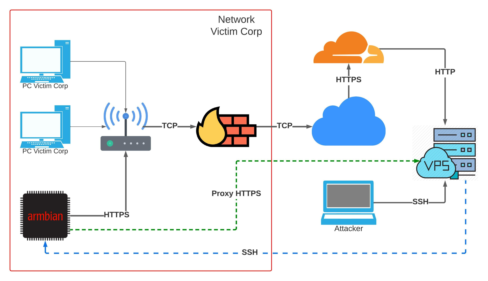

# intruder-deployer
Adversaries may introduce computer accessories, networking hardware, or other computing devices into a system or network that can be used as a vector to gain access - Mitre

## Getting started (Installation)

**How to run the project**
```bash
# Clone this project
git clone https://github.com/nchgroup/intruder-deployer.git
cd intruder-deployer
cp config.sh.example config.sh
# Edit config.sh
nano config.sh
# Upload the files to your server
scp -r -i yourprivkey.pem *.sh uservps@vpserverip:~/intruder-deployer
```

### SSH tunnel preference

**Hardware Backdoor Instalation**

```bash
cd intruder-deployer
bash intruder_installer.sh
# add pub key in your config.sh
bash intruder_config_ssh_443.sh
# done
```

**VPS Installation**

```bash
cd intruder-deployer
bash server_create_user_ssh.sh
# done
```

### HTTPS tunnel (Cloudflare) preference

**Hardware Backdoor Instalation**

```bash
cd intruder-deployer
bash intruder_installer.sh
# your pub key isn't necessary
bash intruder_config_proxy_https.sh
# done
```

**VPS Installation**

```bash
# you need configure in Cloudflare your domain
cd intruder-deployer
bash server_https_proxy.sh
# done
```

**Create subdomain in Cloudflare in your personal PC**

```bash
git clone https://github.com/nchgroup/intruder-deployer.git
cd intruder-deployer
# this script create a subdomain in Cloudflare
bash cloudflare-subdom-config.sh
# done
```

## Tools installed

* arp-scan
* autossh
* bettercap
* chisel
* crackmapexec
* dnscrypt-proxy
* ettercap
* firewalld
* fscrypt
* golang
* hping3
* libpcap-dev
* macchanger
* nbtscan
* netdiscover
* nmap
* prips
* proxychains4
* python3-dev
* python3-pip
* responder
* scapy
* simplehttpserver
* sslh
* tcpdump
* traceroute
* tshark
* wipe


# Network topology of the backdoor (Armbian)

## VPS with Cloudflare


# OS Compatibility
* Ubuntu 22.04 client/server

## Tested on root user only client
* Nanopi Neo 512MB: https://redirect.armbian.com/nanopineo/Jammy_current
* Orange pi Zero2 1GB (Ubuntu 22.04): http://www.orangepi.org/html/hardWare/computerAndMicrocontrollers/service-and-support/Orange-Pi-Zero-2.html

## Tested on VPS providers
* Vultr: https://www.vultr.com/
* Amazon AWS: https://aws.amazon.com/

# Hardware Info

* Nanopi Neo: https://www.friendlyelec.com/index.php?route=product/product&path=69&product_id=132
* Orange pi Zero2: http://www.orangepi.org/html/hardWare/computerAndMicrocontrollers/details/Orange-Pi-Zero-2.html

# Reference

* Hardware Backdoor (ESP): https://vay3t.medium.com/red-team-caso-de-uso-de-un-backdoor-f%C3%ADsico-e1a6254ce29a
* Hardware Additions: https://attack.mitre.org/techniques/T1200/

# Authors

* Gonzalo Villegas - https://twitter.com/pwner666 - https://gitlab.com/gvillegas
* Vay3t - https://twitter.com/vay3t - https://gitlab.com/vay3t
